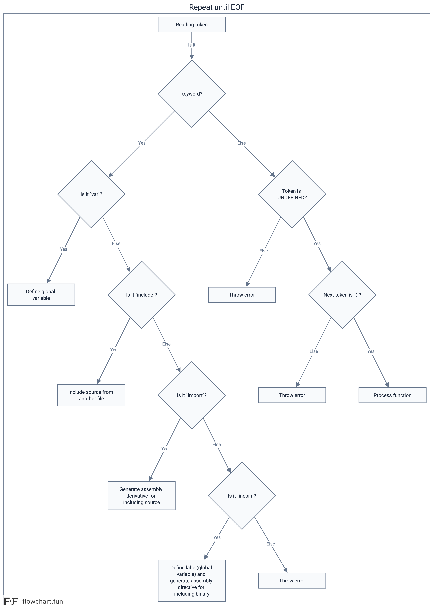

# BSimple. Записки сумасшедшего, или как я решил написать компилятор.

## Что же дальше?

Итак, у нас есть возможность получить текущий токен, у нас есть таблица символов — настало время начать переводить наш код в ассемблер.

Хоть у нас и есть достаточно конкретный целевой процессор — Zilog eZ80 в ADL-режиме, генератор будет принимать вызовы, исходя лишь из следующих положений:

- У нас есть основной регистр (аккумулятор), способный работать с целым машинным словом (в случае eZ80 эту роль выполняет 24-битный регистр HLU).
- У нас есть дополнительный регистр, способный работать с целым машинным словом (аналогично — DEU).
- Каждый из этих регистров может участвовать в простых операциях: можно присвоить им значение, можно сохранить их в стековую переменную, загрузить из стековой переменной или глобальной переменной из памяти (в т.ч. по адресу, сохранённому в них).
- Мы можем использовать их для хранения аргументов функций и локальных переменных.

Опуская детали реализации, будем условно считать, что вопросы сегментов данных и кода также решает генератор кода — в моей реализации он просто пишет в два разных файла (хотя для ещё большей оптимальности можно использовать три файла: для кода, для константных данных и для сегмента неинициализированных переменных — последний сегмент можно не включать в результирующий файл, что уменьшит размер бинарников после компиляции).

Реализация компиляции будет идти сверху вниз — начнём с разбора самого верхнего уровня и будем постепенно углубляться.

### Компилируем программу

Основной цикл компиляции можно представить в виде следующей диаграммы:



Первым шагом мы читаем токен, и на этом этапе это может быть только идентификатор — ничто другое сейчас нам не подойдёт. Если встретили что-то отличное — это точно ошибка.

**На данный момент** программа может содержать следующие блоки:

- Объявление глобальных переменных — ключевое слово `var` в качестве текущего токена;
- Подключение дополнительного исходного файла — ключевое слово `include`;
- Подключение ассемблерного исходного файла в результирующий проект (или скомпилированной программы на BSimple) — `import`;
- Подключение бинарного файла в качестве данных — `incbin`;
- И объявление функции — **идентификатор, отсутствующий в таблице символов**.

Рассмотрим наиболее важные моменты поэтапно.

---

### Объявление глобальной переменной

При объявлении глобальной переменной первым делом мы проверяем, что этот символ не занят. Если символ не определён — регистрируем его в таблице символов, считаем, что текущая размерность переменной — 1 слово. Проверяем следующий токен:

- Если это `[` — пробуем считать размер массива:
  * Читаем токен, ожидая, что это число (иначе — ошибка);
  * Умножаем размерность на число, указанное в квадратных скобках;
  * Проверяем, что следующий токен — закрывающая квадратная скобка;

- Если это `;` — сохраняем переменную в памяти (размером 1 слово) и заканчиваем обработку списка переменных;
- Если это `,` — сохраняем переменную в памяти (размером 1 слово) и продолжаем обработку списка переменных.

Итоговый код будет выглядеть примерно так:

```c
void write_global_var(char *name, int size)
{
    sprintf(buf, "_%s:\tds %u\n", name, size);
    write_code(buf);
}

void global_var()
{
    int size = 1;
    char name[MAX_TOKEN_SIZE];
    char tok;

    while (1) {
        if (get_token() != Id) {
            error(UNEXPECTED_SYMBOL);
        }

        if (lookup_symbol(current_token) != 0) {
            error(CANT_REDEFINE);
        }

        strcpy(name, current_token);
        register_glob(name);

        printf("var %s\n", name);

        tok = get_token();
        if (tok == LS) {
            if (get_token() == Number) {
                size = atoi(current_token);

                if (get_token() != RS)
                    error(UNEXPECTED_SYMBOL);

                tok = get_token();
            } else {
                error(UNEXPECTED_SYMBOL);
            }
        }

        if (tok == EOS) {
            write_global_var(name, WORD_SIZE * size);
            return;
        }

        if (tok == Comma) {
            write_global_var(name, WORD_SIZE * size);
            size = 1;
            continue;
        }

        error(UNEXPECTED_SYMBOL);
    }
}
```

---

### Определение функций

Другой важный элемент, обрабатываемый на этом этапе — определение функций.

Каждое определение функции начинается с её имени, за которым обязательно идёт токен `(`, открывающий список аргументов.

Функция, как и переменные, регистрируется как глобальный идентификатор, а также в секцию кода сохраняется её преамбула.

Считая смещение от стека для каждого аргумента, мы регистрируем их в таблице символов, читая идентификаторы до закрывающей круглой скобки, при этом аргументы разделяются запятыми.

Формат фрейма вызова у меня реализован так же, как в C-компиляторе от Zilog (в т.ч. ради совместимости), и его можно посмотреть на рисунке ниже:


Далее ожидаем открывающую фигурную скобку — признак начала блока — и переходим к обработке команд в блоке. Это отдельный уровень "глубины" разбора и будет рассмотрен отдельно.

По завершению обработки блока мы пишем завершающий код функции (восстановление указателя стека и возврат по адресу на стеке), а затем сбрасываем таблицу символов, удаляя все локальные переменные и аргументы — остаются только ключевые слова и глобальные символы.

---

### Обработка блоков кода

Обработка блоков кода — это последовательный разбор команд, пока не встретится токен конца блока.

Наиболее объёмная часть компилятора находится именно здесь.

В общем случае, возможны три варианта:

- Обработка ключевых слов языка (например, циклы, условные операторы, объявление переменных, возврат из функции и т.д.);
- Операции присваивания;
- Вызовы функций.

На самом деле я начинал с присваиваний переменным (и отлаживал этот процесс по дампам памяти) — результат будет заметен сразу (хотя бы в дампах), а заодно на этом этапе реализуются базовые части обработки выражений.

Я опущу часть деталей реализации и многие моменты — всё-таки это не учебник по компилятору, а скорее рассказ о том, как это было (с пометкой, что это **НЕ** лучший путь).

---

### Обработка присваивания (и вычисляемые значения)

Столкнувшись с конструкцией "идентификатор" и "знак равенства", мы понимаем, что нужно присвоить этому идентификатору какое-либо значение.

Сохраняем имя переменной, в которую нужно сохранить значение, затем вычисляем само значение.

Со стороны присваивания — это чёрный ящик: главное, чтобы значение оказалось в аккумуляторе. А дальше — в зависимости от типа переменной, оно будет записано либо в стек, либо в глобальное хранилище.

Если символ не найден в таблице символов — считаем, что это глобальная переменная из библиотеки (ошибка, если таковой нет, будет обнаружена на этапе сборки ассемблером).

```c
void process_assing()
{
    char to[MAX_TOKEN_SIZE];
    char token;
    char res;
    Symbol *s;

    strcpy(to, l_value);
    s = lookup_symbol(to);

    res = process_expression();
    if (res != EOS && res != RP) {
        error(UNEXPECTED_SYMBOL);
    }

    if (s && (s->type == Auto || s->type == Parameter)) {
        store_to_stack_var(s->offset);
        return;
    }

    if (!s || s->type == Glob) {
        store_to_global_var(to);
        return;
    }

    error(NOT_VALID_IDENTIFIER);
}
```

---

### Разбор выражений

Разбор выражений — более хитрый момент. Он состоит из двух этапов: разбор значений и, при необходимости, выполнение операций между ними.

В самом простом случае (например, число) значение просто считывается и записывается либо в аккумулятор (если это первое значение), либо в дополнительный регистр (если не первое).

```c
void set_accumulator(int value)
{
    sprintf(buf, "\tld hl,%i\n", value);
    write_code(buf);
}

void set_additional(int value)
{
    sprintf(buf, "\tld de,%u\n", value);
    write_code(buf);
}

char process_value(char is_acc)
{
    char token, c;
    int value, is_minus;
    Symbol *s;

    is_minus = 0;
    token = get_token();
    if (token == Dec) {
        is_minus = 1;
        token = get_token();
    }

    switch (token) {
    // Skipped
    case Number:
        value = atoi(current_token);
        if (is_minus) {
            value = -value;
        }
        if (is_acc)
            set_accumulator(value);
        else
            set_additional(value);
        break;
    }

    return token;
}
```

Один из частных случаев — обработка строковых литералов.

А вся обработка выражения управляется функцией, которая вызывает генерацию кода по мере распознавания операторов, пока не встретит `;`.

```c
void sum_regs()
{
    write_code("\tadd hl,de\n");
}

char process_expression()
{
    char token;
    int value;
    char is_first = 1;
    Symbol *s;

    if (process_value(1) == EOS)
        return EOS;

    while (1) {
        token = get_token();
        switch (token) {
        case Sum:
            value = process_value(0);
            sum_regs();
            if (value == EOS)
                return EOS;
            break;
        // Skipped
        default:
            return token;
        }
    }
}
```

Написание компилятора с нуля — это путь, полный подводных камней, странных багов и неожиданных моментов радости, когда всё наконец-то начинает работать. BSimple далёк от идеала, но это рабочая основа, которая помогла мне разобраться, что на самом деле происходит «под капотом» — от разбора токенов до генерации ассемблера.

Это не руководство и не образец лучших практик — это просто мой опыт, со всеми его шероховатостями. И если вы задумываетесь о том, чтобы написать собственный компилятор — дерзайте. Вы узнаете гораздо больше, чем ожидали.

Удачи!