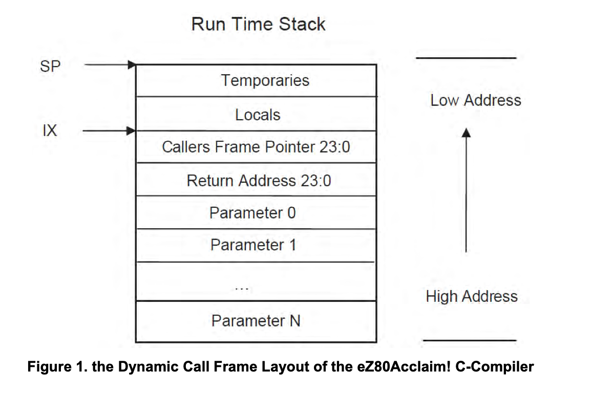

# BSimple. Diary of a Madman, or How I Decided to Write a Compiler.

## What Next?

So, we have the ability to get the current token, we have a symbol table — it’s time to start translating our code into assembly.

Even though we have a fairly specific target processor — the Zilog eZ80 in ADL mode — the code generator will work based on the following assumptions:

- We have a primary register (accumulator) capable of operating on a full machine word (on the eZ80, this role is performed by the 24-bit HLU register).
- We have a secondary register capable of operating on a full machine word (similarly — the DEU register).
- Each of these registers can participate in basic operations: we can assign them values, save them to stack variables, or load them from stack or global memory (including via a pointer stored in them).
- We can use them to store function arguments and local variables.

Skipping the implementation details for now, we’ll assume that the code generator also handles the data and code segmentation — in my implementation, it simply writes to two separate files (although, for even better optimization, three files can be used: one for code, one for constant data, and one for uninitialized variables — the latter segment doesn't have to be included in the final binary, which reduces the output file size).

We’ll implement compilation in a top-down manner — starting from the highest-level parsing and drilling down as needed.

---

### Compiling a Program

The main compilation loop can be visualized with the following diagram:


The first step is reading a token, and at this point it can only be an identifier — nothing else is valid here. If we encounter something else, it’s definitely an error.

**At this stage**, the program can consist of the following blocks:

- Declaration of global variables — the `var` keyword is expected;
- Inclusion of an additional source file — `include`;
- Inclusion of an assembly source file into the resulting project (or a precompiled BSimple program) — `import`;
- Inclusion of a binary file as data — `incbin`;
- And function definitions — **identifiers that are not present in the symbol table**.

Let’s break down the most important parts step by step.

---

### Declaring Global Variables

When declaring a global variable, the first thing we do is check whether the symbol is already taken. If the symbol is undefined, we register it in the symbol table, assume the initial variable size to be one word, and read the next token:

- If it’s `[`, we try to read the array size:
  * Read the next token, expecting it to be a number (otherwise — error);
  * Multiply the current size by the specified value;
  * Ensure that the following token is a closing square bracket;

- If the next token is `;`, we store the variable in memory (1 word in size) and finish processing the list;
- If it’s `,`, we store the variable (1 word in size) and continue processing the next item.

The resulting code looks roughly like this:

```c
void write_global_var(char *name, int size)
{
    sprintf(buf, "_%s:\tds %u\n", name, size);
    write_code(buf);
}

void global_var()
{
    int size = 1;
    char name[MAX_TOKEN_SIZE];
    char tok;

    while (1) {
        if (get_token() != Id) {
            error(UNEXPECTED_SYMBOL);
        }

        if (lookup_symbol(current_token) != 0) {
            error(CANT_REDEFINE);
        }

        strcpy(name, current_token);
        register_glob(name);

        printf("var %s\n", name);

        tok = get_token();
        if (tok == LS) {
            if (get_token() == Number) {
                size = atoi(current_token);

                if (get_token() != RS)
                    error(UNEXPECTED_SYMBOL);

                tok = get_token();
            } else {
                error(UNEXPECTED_SYMBOL);
            }
        }

        if (tok == EOS) {
            write_global_var(name, WORD_SIZE * size);
            return;
        }

        if (tok == Comma) {
            write_global_var(name, WORD_SIZE * size);
            size = 1;
            continue;
        }

        error(UNEXPECTED_SYMBOL);
    }
}
```

---

### Function Definitions

Another important element handled at this stage is function definitions.

Every function definition begins with its name, followed by the opening parenthesis `(` which starts the argument list.

Just like variables, the function is registered as a global symbol, and a prologue is written into the code section.

As we process each argument, we calculate its stack offset and register it in the symbol table, reading identifiers until we encounter a closing parenthesis. Arguments are separated by commas.

The call frame format in my implementation matches the one used by Zilog’s C compiler (for compatibility, among other reasons), and it's shown below:



Next, we expect an opening curly brace to mark the beginning of the function body, and we start processing the code block. This introduces a new “depth” of parsing, which we’ll explore separately.

After processing the block, we generate the function epilogue (restoring the stack pointer and returning via the address on the stack), and reset the symbol table, removing all local variables and parameters — only keywords and global symbols remain.

---

### Processing Code Blocks

Processing a code block means sequentially parsing each statement, one after another, until an end-of-block token is encountered.

This is the largest and most complex part of the compiler.

In the general case, we have three possible branches:

- Processing language keywords (e.g. loops, conditionals, variable declarations, function returns, etc.);
- Assignment operations;
- Function calls.

In my case, I actually started with variable assignments (and debugged them via memory dumps) — the results are immediately visible (at least in memory dumps), and this is also the stage where core expression handling is introduced.

I’ll skip many implementation details — this isn't a compiler-writing tutorial, but rather a story of how it happened (with the disclaimer that this is **NOT** the best way to do it).

---

### Handling Assignments (and Computed Values)

When we encounter an "identifier" followed by an equals sign, we know it’s time to assign a value to that identifier.

We store the identifier (the target), and proceed to compute the value.

From the assignment's perspective, the computation is a black box — the only requirement is that the result ends up in the accumulator. Then, depending on whether the variable is local or global, the value is stored appropriately.

If the symbol isn’t found in the table — we assume it’s a global variable from a library (an error will be raised at assembly time if it’s missing).

```c
void process_assing()
{
    char to[MAX_TOKEN_SIZE];
    char token;
    char res;
    Symbol *s;

    strcpy(to, l_value);
    s = lookup_symbol(to);

    res = process_expression();
    if (res != EOS && res != RP) {
        error(UNEXPECTED_SYMBOL);
    }

    if (s && (s->type == Auto || s->type == Parameter)) {
        store_to_stack_var(s->offset);
        return;
    }

    if (!s || s->type == Glob) {
        store_to_global_var(to);
        return;
    }

    error(NOT_VALID_IDENTIFIER);
}
```

---

### Parsing Expressions

Expression parsing is a bit more nuanced. It consists of two phases: value parsing and, if needed, evaluating operations between them.

In the simplest case (e.g. a number), the value is read and written either to the accumulator (if it’s the first operand) or to the secondary register (if not).

```c
void set_accumulator(int value)
{
    sprintf(buf, "\tld hl,%i\n", value);
    write_code(buf);
}

void set_additional(int value)
{
    sprintf(buf, "\tld de,%u\n", value);
    write_code(buf);
}

char process_value(char is_acc)
{
    char token, c;
    int value, is_minus;
    Symbol *s;

    is_minus = 0;
    token = get_token();
    if (token == Dec) {
        is_minus = 1;
        token = get_token();
    }

    switch (token) {
    // Skipped
    case Number:
        value = atoi(current_token);
        if (is_minus) {
            value = -value;
        }
        if (is_acc)
            set_accumulator(value);
        else
            set_additional(value);
        break;
    }

    return token;
}
```

One specific case involves string literals.

Actual expression handling involves calling the code generator logic on the parsed values, continuing until a `;` is reached.

```c
void sum_regs()
{
    write_code("\tadd hl,de\n");
}

char process_expression()
{
    char token;
    int value;
    char is_first = 1;
    Symbol *s;

    if (process_value(1) == EOS)
        return EOS;

    while (1) {
        token = get_token();
        switch (token) {
        case Sum:
            value = process_value(0);
            sum_regs();
            if (value == EOS)
                return EOS;
            break;
        // skip
        default:
            return token;
        }
    }
}
```

Writing a compiler from scratch is a journey full of pitfalls, strange bugs, and moments of unexpected joy when things finally work. BSimple is far from perfect, but it’s a working foundation that helped me understand what’s really happening under the hood — from parsing tokens to generating assembly.

This isn’t a guide or a best practice — it’s just my experience, messy and real. And if you're thinking about building your own compiler: do it. You’ll learn more than you ever expected.

Happy coding!
